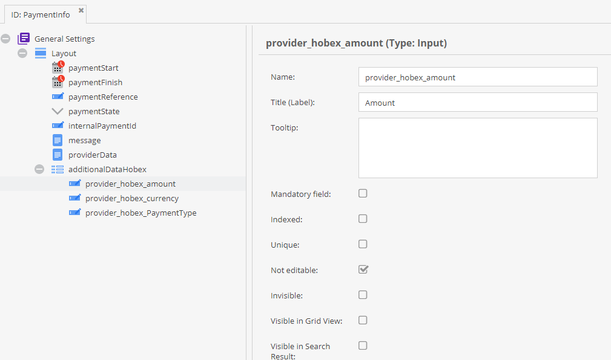

# Pimcore E-Commerce Framework Payment Provider - Hobex

### Official Hobex Documentation
* [Getting Started](https://hobex.docs.oppwa.com/)
* [COPYandPAY Integration Guide](https://hobex.docs.oppwa.com/tutorials/integration-guide)
* [API Reference](https://hobex.docs.oppwa.com/reference/parameters) 

## Requirements
Hobex does not require an additional PHP-SDK. You just need to get a test account from your integration partner.


## Installation

Install latest version with composer:
```bash 
composer require pimcore/payment-provider-hobex
```

Enable bundle via console or extensions manager in Pimcore backend:
```bash
php bin/console pimcore:bundle:enable PimcorePaymentProviderHobexBundle
php bin/console pimcore:bundle:install PimcorePaymentProviderHobexBundle
```

## Configuration
The Payment Manager is responsible for implementation
of different Payment Provider to integrate them into the framework. 

For more information about Payment Manager, see 
[Payment Manager Docs](../13_Checkout_Manager/07_Integrating_Payment.md). 

Configure payment provider in the `pimcore_ecommerce_config.payment_manager` config section: 
```yaml
pimcore_ecommerce_framework:
    
    # ...
    
    # add hobex to the set of active payment providers
    payment_manager:
        providers:
            hobex_testprovider:
                provider_id: Pimcore\Bundle\EcommerceFrameworkBundle\PaymentManager\Payment\Hobex                    
                profile: sandbox
                profiles:
                    sandbox:
                        entityId: '8a829418530df1d201531299e097175c'
                        authorizationBearer: 'OGE4Mjk0MTg1MzBkZjFkMjAxNTMxMjk5ZTJjMTE3YWF8ZzJnU3BnS2hLUw=='
                        testSystem: true
                        payment_methods:
                            - VISA
                            - MASTER
                            - SOFORTUEBERWEISUNG
                            - SEPA
    
    # ...
    # configure the payment provider in the checkout manager
    checkout_manager:
        tenants:
            _defaults:
                payment:
                    provider: hobex_testprovider
            default: ~                              
```

Payment Information: Order payment section "Payment Informations" stores information about every payment trial by Customer.

Add additional fields in "PaymentInfo" fieldcollection, so that Order Manager stores information in Order object:



Hobex is compatible with Pimcore 10, so for Pimcore 6 you may have to add the following line to your config.yml:
```yml
    - { resource: '@PimcoreEcommerceFrameworkBundle/Resources/config/v7_configurations.yml' }
```


## Implementation

CheckoutController.php
```php
  /**
     * Payment step of the checkout.
     * This is where the payment widget is initialized and displayed.
     * @Route("/checkout/payment")
     * @param Request $request
     */
    public function payment(Request $request, Factory $factory) {
        $cartManager = $factory->getCartManager();
        $orderManager = $factory->getOrderManager();

        $cart = $cartManager->getCartByName('cart');
        $checkoutManager = Factory::getInstance()->getCheckoutManager($cart);

        $order = $orderManager->getOrCreateOrderFromCart($cart);       

        $requestConfig = new HobexRequest();
        $requestConfig
            ->setShopperResultUrl($this->generateUrl('app_webshop_payment_result'))
            ->setLocale('de')
        ;
        
        /** @var SnippetResponse $paymentInitResponse */
        $paymentInitResponse = $checkoutManager->startOrderPaymentWithPaymentProvider($requestConfig);

        return $this->renderTemplate('Webshop/Checkout/payment.html.twig', [
            'cart' => $cart,
            'order' => $order,
            'renderedForm' => $paymentInitResponse->getSnippet()
        ]);
    }
    
    /**
     * Final step of the example payment checkout.
     * This is called then the payment succeeded and the order got confirmed.
     * @Route("/checkout/success")
     * @param Request $request
     */
    public function success(Request $request) {
        // needs some implementation. Typically a success page is rendered.
    }
```

app/Resources/views/Webshop/Checkout/payment.html.twig:
```twig


    <div class="container" style="margin-top:2em">
        <div class="row">
            <div class="col-md-12">
                <h1>💰 Example Checkout / Payment</h1>
               
                <hr/>
                <h5>Order:</h5>
                <ul>
                    <li>ID: {{ order.id }}</li>
                    <li>Number: {{ order.ordernumber }}</li>
                </ul>

                <hr/>
                
                {{ #payment widget: }}
                {{ renderedForm | raw }}

                <hr/>

                <a class="btn btn-info" href="{{ path('app_webshop_cart_list') }}">⏎ Back To Cart</a>

            </div>
        </div>
    </div>

```

PaymentController:
```php
    /**
     * In the payment controller the response from Hobex payments is handled.
     * This action is typically called when the payment succeeded. 
     * @Route("/checkout/payment/result")
     * @param Request $request
     */
    public function result(Request $request, Factory $factory) {

        $cartManager = $factory->getCartManager();
        $orderManager = $factory->getOrderManager();

        $paymentProvider = Factory::getInstance()->getPaymentManager()->getProvider("hobex_testprovider");

        $order = Factory::getInstance()->getCommitOrderProcessor()->handlePaymentResponseAndCommitOrderPayment(
            $request->query->all(),
            $paymentProvider
        );

        if ($order->getOrderState() == AbstractOrder::ORDER_STATE_COMMITTED) {
            return $this->redirectToRoute('app_webshop_checkout_success');
        } else {           
            $errorMessage = 'Something wrent wrong with the payment: '.$order->getLastPaymentInfo()->getMessage());
            // error handling ...
            return $this->redirectToRoute('app_webshop_checkout_step1');
        }

    }
```

## Implementation
see https://hobex.docs.oppwa.com/tutorials/webhooks/configuration

If you want to use webhooks, you have to configure the webhook secret: 

```yaml
pimcore_ecommerce_framework:
    
    # ...
    
    # add hobex to the set of active payment providers
    payment_manager:
        providers:
            hobex_testprovider:
                provider_id: Pimcore\Bundle\EcommerceFrameworkBundle\PaymentManager\Payment\Hobex                    
                profile: sandbox
                profiles:
                    sandbox:
                        entityId: '8a829418530df1d201531299e097175c'
                        authorizationBearer: 'OGE4Mjk0MTg1MzBkZjFkMjAxNTMxMjk5ZTJjMTE3YWF8ZzJnU3BnS2hLUw=='
                        # optional: if you configured webhook, you need to configure the secret here  
                        webhookSecret: '353FADF1340CA4AFA7052AD8BAAEA788E177C9D9CFC8271294F53CA83F4DB4AD' 
                        testSystem: true
                        payment_methods:
                            - VISA
                            - MASTER
                            - SOFORTUEBERWEISUNG
                            - SEPA
    
                              
```

Example of controller/Action to handle the webhook response: 


PaymentController:
```php
    /**
     * In the payment controller the webhook response from Hobex payments is handled.
     * @Route("/checkout/payment/webhook")
     * @param Request $request
     */
    public function webhookAction(Request $request){
        $paymentProvider = Factory::getInstance()->getPaymentManager()->getProvider("hobex_testprovider");
        $order = Factory::getInstance()->getCommitOrderProcessor()->handlePaymentResponseAndCommitOrderPayment(
                ['base64Content' => $request->getContent(), 'authTag' => $request->headers->get('x-authentication-tag'),
                 'initVector' => $request->headers->get('x-initialization-vector')],
                $paymentProvider
            );
        return new Response('ok',200);

    }

```
